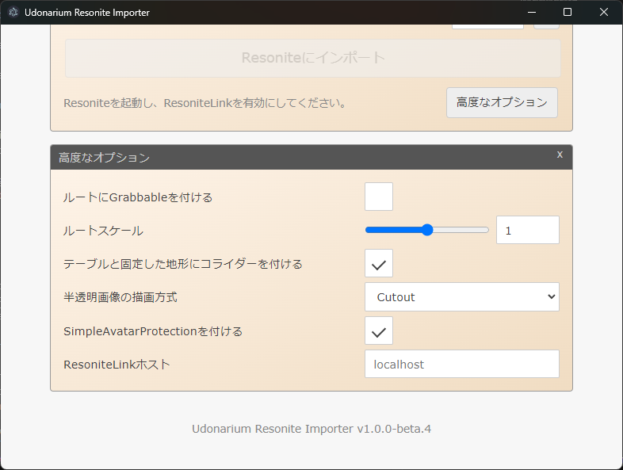

# Udonarium Resonite Importer

Resonite ユーザーが、ユドナリウムで配布されているセーブデータを取り込んで遊べるようにするツールです。

## 紹介動画

動画リンク: https://youtu.be/3CHq_KOcIwQ

## このツールで何ができる？

ユドナリウムのセーブデータ ZIP を Resonite にインポートし、盤面の見た目と配置をまとめて再現できます。  
キャラクター、カードと山札、ダイス、テーブル、地形、マップマスクに対応しています。

## ユドナリウムって何？

ユドナリウムは、Web ブラウザで動くオンラインセッション用ツール（Virtual Tabletop）です。  
主にボードゲーム、TTRPG、マーダーミステリーなどで使われています。

日本語圏では、ユドナリウム用のセーブデータ（ZIP）が多数配布されています。  
このツールは、それらのデータを Resonite に持ち込んで遊ぶことを目的にしています。

## どうやって使う？

### 1. アプリを入手

[Booth](https://trivr.booth.pm/items/8034445) または [GitHub Releases](https://github.com/TriVR-TRPG/udonarium-resonite-importer/releases/latest) から ZIP をダウンロードし、展開した `Udonarium Resonite Importer` を起動してください。

### 2. Resonite 側を準備

Resonite を起動し、新規ワールドを作成してください。未インストールの場合は Steam からインストールしてください。  
Steam: https://store.steampowered.com/app/2519830

ダッシュメニューのセッションタブで「ResoniteLinkを有効化」を実行し、「ResoniteLink がポート [数字] で動作中」と表示されたら準備完了です。

### 3. インポート実行

アプリでユドナリウムのセーブデータ ZIP を選択し、手順 2 のポート番号を入力して「Resoniteにインポート」を押してください。

---

## もっと詳しく

### インポート時の挙動

- インポートしたオブジェクトは RootSlot 直下に生成されます。
- ルートスロット名は `Udonarium Import - [ZIPファイル名]` です。
- ルートには `udonarium-resonite-importer:root` タグが付きます。
- RootSlot 直下に同タグを持つ既存スロットがある場合は、既存スロットを置き換えます。
- 置き換え時は同じ Transform（位置・回転・大きさ）で再配置します。

### 高度なオプション

通常はデフォルトのまま使えます。必要な場合のみ変更してください。

- ルートにGrabbableを付ける（初期値: オフ）
  - 盤面全体を掴めるようにします。
- ルートスケール（初期値: 1 (m)）
  - ルートスケールを変更できます。
  - 既存の `udonarium-resonite-importer:root` タグ付きスロットがある場合、そのスケールが優先されます。
  - 初期状態では 1 マス = 1 m になるよう変換されます。
- テーブルと固定した地形にコライダーを付ける（初期値: オン）
  - CharacterCollider を付与し、乗れるようにしつつ壁のすり抜けを防げます。
  - 固定されていない地形には付与しません。
- 半透明画像の描画方式（初期値: Cutout）
  - 半透明画像の BlendMode を一括で設定できます（個別設定はできません）。
  - `Cutout`: 透明度しきい値未満を描画しません（切り抜き向け）。
  - `Alpha`: 透明度に応じて描画します（重なり時に奥側の表示が欠ける場合あり）。
- SimpleAvatarProtectionを付ける（初期値: オン）
  - 自分以外が保存できないようにできます。
  - 誰でも保存してよいものをインポートする場合のみオフにしてください。
- ResoniteLinkホスト（初期値: localhost）
  - localhost 以外の ResoniteLink を使う場合に指定できます（未検証）。

### MMC26 エントリー
このツールは Metaverse Maker Competition 2026 にエントリーした作品です。  
エントリー時点のバージョン: [v1.0.1](https://github.com/TriVR-TRPG/udonarium-resonite-importer/releases/tag/v1.0.1)

- イベント: [Metaverse Maker Competition 2026](https://youtu.be/MHxobH-TkKc)
- カテゴリ: `その他: TAU`
- ワールド: [[MMC26] Udonarium Resonite Importer - Resonite](https://go.resonite.com/world/G-1Nc5BgekFJQ/R-b0e1dc28-fec9-48cb-8fee-58459f3f637a)

### クレジット

- チーム: とらいばーる
- 開発者: yoshi1123_
- テスター: ankou, ifura, KTY, usaturn, Karabina, 佐々宮智志
- フィードバック: lill

使用アセット:

- ユドナリウム公式アセット: https://github.com/TK11235/udonarium

使用ツール:

- コーディング: VSCode
- Vibe Coding & 翻訳: Claude Code, GitHub Copilot, ChatGPT/Codex
- ResoniteLink ライブラリ: tsrl https://www.npmjs.com/package/@eth0fox/tsrl
- 動画編集: DaVinci Resolve
- CreditPanelMaker https://uni-pocket.com/ja/items/5844a937-4a1f-43b4-b104-f987b80792b7

動画内で使用しているアセット:

- BGM: 魔王魂 https://maou.audio/bgm_cyber13/ - [CC BY 4.0](https://creativecommons.org/licenses/by/4.0/)
- ユドナ用ルームデータ（テーブル数47） | ouma https://ouma.booth.pm/items/5499018
- 【D&D5版】ダンジョン＆ドラゴンズ第5版シナリオ「囚われの花嫁」 | しらたき置き場 https://nabenosoko.booth.pm/items/3694104

