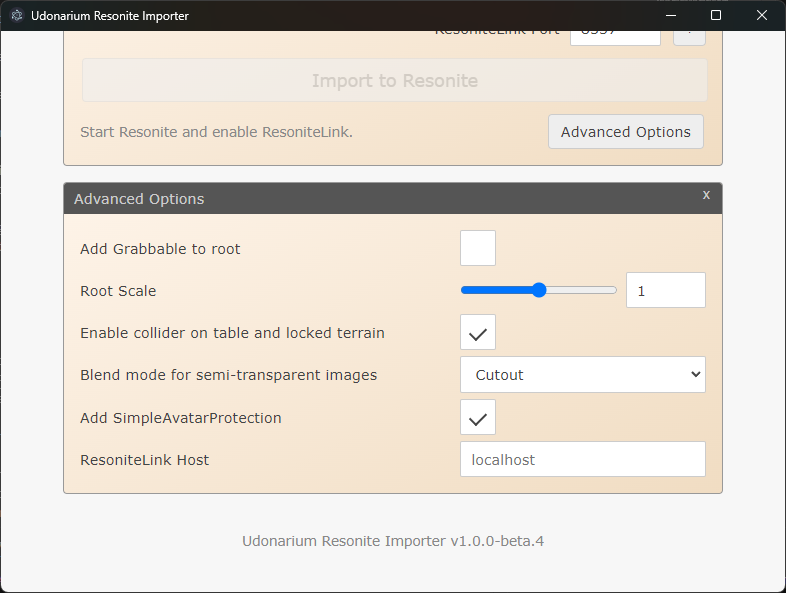

# Udonarium Resonite Importer

A tool for Resonite users to import and play save data distributed for Udonarium.

## Intro Video

Video link: https://youtu.be/xHfjS185Dwc

## What Can This Tool Do?

You can import Udonarium save ZIP files into Resonite and recreate both the board visuals and object placement.
It supports characters, cards/decks, dice, tables, terrain, and map masks.

## What Is Udonarium?

Udonarium is an online session tool (Virtual Tabletop) that runs in a web browser.
It is mainly used for board games, TTRPGs, and murder mystery games.

In Japanese-speaking communities, many Udonarium save files (ZIP) are shared.
This tool is built to bring those data sets into Resonite so you can play them there.

## How Do I Use It?

### 1. Get the App

Download the ZIP from [Booth](https://trivr.booth.pm/items/8034445) or [GitHub Releases](https://github.com/TriVR-TRPG/udonarium-resonite-importer/releases/latest), then launch `Udonarium Resonite Importer` from the extracted folder.

### 2. Prepare Resonite

Start Resonite (if not installed, install it from Steam), then create a new world.
Open the Session tab in the dash menu, enable "ResoniteLink," and wait until you see "ResoniteLink is running on port [number]".

Steam: https://store.steampowered.com/app/2519830

### 3. Run Import

In the app, choose a Udonarium save ZIP, enter the port number from step 2, and click "Import to Resonite".

---

## More Details

### Import Behavior

- Imported objects are created directly under RootSlot.
- The root slot name is `Udonarium Import - [ZIP filename]`.
- The root gets the `udonarium-resonite-importer:root` tag.
- If a slot with the same tag already exists under RootSlot, it is replaced.
- During replacement, the new slot is placed with the same Transform (position, rotation, scale).

### Advanced Options

In most cases, default settings are fine. Change these only when needed.

- Add Grabbable to Root (default: Off)
  - Makes the whole imported board grabbable.
- Root Scale (default: 1 (m))
  - Changes the root scale.
  - If an existing slot with `udonarium-resonite-importer:root` exists, that slot's scale takes priority.
  - By default, size is converted so that 1 tile = 1 meter.
- Add colliders to table and fixed terrain (default: On)
  - Adds CharacterCollider so players can stand on them and not pass through walls.
  - Not applied to non-fixed terrain.
- Transparent image render mode (default: Cutout)
  - Sets BlendMode for all transparent images in bulk (no per-image setting).
  - `Cutout`: Pixels below alpha threshold are not rendered (good for cutout images).
  - `Alpha`: Renders by transparency (overlap may cause objects behind to appear broken).
- Add SimpleAvatarProtection (default: On)
  - Prevents users other than you from saving.
  - Turn this off only when importing content that anyone is allowed to save.
- ResoniteLink Host (default: localhost)
  - Lets you specify a non-localhost ResoniteLink host (not verified).

### MMC26 Entry

- Event: [Metaverse Maker Competition 2026](https://youtu.be/MHxobH-TkKc)
- Category: other tau
- World: [[MMC26] Udonarium Resonite Importer - Resonite](https://go.resonite.com/world/G-1Nc5BgekFJQ/R-b0e1dc28-fec9-48cb-8fee-58459f3f637a)

### Credits

- Developer: yoshi1123_
- Testers: ankou, ifura, KTY, usaturn, Karabina
- Feedback: lill

Assets used:

- Official Udonarium assets: https://github.com/TK11235/udonarium

Tools used:

- Vibe Coding & translation: Claude Code, GitHub Copilot, ChatGPT/Codex
- tsrl: TypeScript implementation library for ResoniteLink https://www.npmjs.com/package/@eth0fox/tsrl
- Video editing: DaVinci Resolve
- CreditPanelMaker https://uni-pocket.com/en/items/5844a937-4a1f-43b4-b104-f987b80792b7

Assets used in the video:

- BGM: [MaouDamashii](https://maou.audio/bgm_cyber13/) - CC BY 4.0 https://creativecommons.org/licenses/by/4.0/
- Udonarium room data (47 tables) | ouma https://ouma.booth.pm/items/5499018
- [D&D 5e] Scenario "Toraware no Hanayome" | Shirataki Okiba https://nabenosoko.booth.pm/items/3694104
